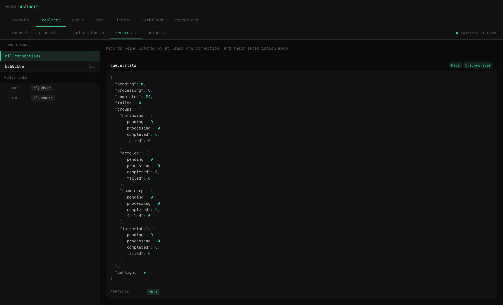
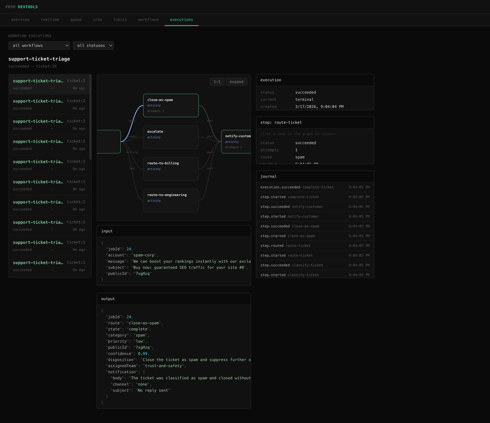

<p align="center">
  
</p>

<h1 align="center">@prsm/devtools</h1>

Read-only Express middleware that provides a live dashboard for observing prsm infrastructure at runtime. Pass your instances and mount the router to get a full UI.

<p align="center">
  
</p>

<p align="center">
  
</p>

## Installation

```bash
npm install @prsm/devtools
```

## Quick Start

```js
import express from 'express'
import { RealtimeServer } from '@prsm/realtime'
import Queue from '@prsm/queue'
import { Cron } from '@prsm/cron'
import { slidingWindow } from '@prsm/limit'
import WorkflowEngine from '@prsm/workflow'
import { createGraph } from '@prsm/cells'
import { prsmDevtools } from '@prsm/devtools'

const app = express()

const realtime = new RealtimeServer({ redis: { host: '127.0.0.1', port: 6379 } })
const queue = new Queue({ concurrency: 5 })
const cron = new Cron()
const apiLimiter = slidingWindow({ max: 100, window: '1m' })
const workflow = new WorkflowEngine()
const portfolio = createGraph({ prefix: 'portfolio:' })

app.use('/devtools', prsmDevtools({
  realtime,
  queue,
  cron,
  limit: { api: apiLimiter },
  workflow,
  cells: { portfolio },
}))

app.listen(3000)
// open http://localhost:3000/devtools
```

Everything is optional. Only pass what you have - tabs appear only for connected subsystems.

## What You See

**Overview** - unified event stream from all subsystems, live via SSE

**Realtime** - full inspector for `@prsm/realtime` with sub-tabs:

- **Rooms** - active rooms, members, per-member presence state
- **Channels** - channels with active subscribers
- **Collections** - collections with subscribers, expandable resolved records per connection
- **Records** - subscribed records with live-updating data view (via SSE) and subscription mode per connection
- **Metadata** - detailed connection view with rooms, channels, collections, records, and presence

Includes a connection picker sidebar for filtering all views by a specific client, and a registered patterns panel showing exposed channels, records, collections, presence, and commands.

**Queue** - in-flight count (polled), completed/failed/retried counters (session), event log

**Cron** - registered jobs with next fire times, fire/error event log

**Limits** - registered limiters, peek inspector (inspect a key without consuming)

**Workflows** - registered workflow definitions with interactive graph view, step inspector, retry/timeout metadata

**Executions** - workflow execution list with filters, live graph overlay showing execution progress, per-step state, output/error inspector, and journal timeline

**Meter** - inspector for `@prsm/meter`. The catalog lists every metric with its unit and aggregate. Look up a subject to see its current-period usage across all metrics, then scope any metric to a window (a calendar period like `month`, a rolling duration like `30 days`, or an explicit date range) and check it against a quota.

**Entitle** - inspector for `@prsm/entitle`. The plan catalog shows every plan's features and limits and the default plan. Resolve a subject to see its effective plan, feature flags, and limits after overrides, and check any limit against live usage when a meter is composed in.

**Cells** - one or more `@prsm/cells` graphs with two views per graph:

- **Table** - every cell in the graph with current value, dependencies, status, and last-updated time. Click a row to open a detail panel below
- **Graph** - DAG visualization with topologically-laid-out nodes and live propagation flashes when values change

The detail panel shows the cell's current value (syntax-highlighted JSON), source descriptor, metadata, template body (for templated cells), recent history (for cells with history enabled), and graph relationships. Pass a single graph or a named map of graphs - the panel includes a graph picker when more than one is provided.

## API

### `prsmDevtools(options)`

Returns an Express `Router`. Mount it wherever you want.

```js
app.use('/devtools', prsmDevtools(options))
```

#### Options

| Option | Type | Description |
| --- | --- | --- |
| `realtime` | `RealtimeServer` | A `@prsm/realtime` server instance |
| `queue` | `Queue` | A `@prsm/queue` instance |
| `cron` | `Cron` | A `@prsm/cron` instance |
| `limit` | `Object<string, Limiter>` | Named limiters from `@prsm/limit` |
| `workflow` | `WorkflowEngine` | An `@prsm/workflow` engine instance |
| `cells` | `Graph` or `Object<string, Graph>` | A `@prsm/cells` graph instance, or a named map of graphs |
| `meter` | `Meter` or `Object<string, Meter>` | A `@prsm/meter` instance, or a named map of meters |
| `entitle` | `Entitlements` or `Object<string, Entitlements>` | A `@prsm/entitle` instance, or a named map of resolvers |
| `realtimeChannelBufferSize` | `number` | How many recent messages to retain per realtime channel (default `100`) |

All options are optional. The dashboard adapts to what's provided.

### Endpoints

The middleware exposes these under its mount path:

| Endpoint | Description |
| --- | --- |
| `GET /api/config` | Which subsystems are connected |
| `GET /api/events` | SSE stream (queue, cron, workflow, realtime record and channel message updates) |
| `GET /api/queue` | Current in-flight count |
| `GET /api/cron` | Registered jobs with next fire times |
| `GET /api/limits` | List of named limiters |
| `GET /api/limits/:name/peek/:key` | Peek at a limiter key |
| `GET /api/workflows` | Registered workflows with graph data |
| `GET /api/workflows/describe` | One workflow definition |
| `GET /api/workflow/executions` | Workflow executions, filterable by workflow/status |
| `GET /api/workflow/executions/:id` | One workflow execution |
| `GET /api/realtime/state` | Full realtime state snapshot |
| `GET /api/realtime/connection/:id` | Detailed connection info |
| `GET /api/realtime/room/:name` | Room members with metadata and presence |
| `GET /api/realtime/channel/:channel/messages` | Recent messages observed on a channel |
| `GET /api/realtime/record/:id` | Fetch a record's current value |
| `GET /api/realtime/collection/:id/records` | Resolved records for a collection + connection |
| `GET /api/cells/:graph` | All cells in the named graph with values, deps, status, metadata |
| `GET /api/cells/:graph/:name/history` | Recent values for a cell (if history is enabled on it) |
| `GET /api/meter/:name/catalog` | A meter's period and declared metric catalog |
| `GET /api/meter/:name/subjects?limit=` | Subjects with recorded usage, most-recently-active first |
| `GET /api/meter/:name/summary?subject=` | A subject's current-period usage across every metric |
| `GET /api/meter/:name/usage?subject=&metric=&period=` | Windowed usage for one metric (also accepts `rangeStart`/`rangeEnd`) |
| `GET /api/meter/:name/check?subject=&metric=&limit=` | Usage for one metric checked against a quota |
| `GET /api/entitle/:name/catalog` | The plan catalog, default plan, and feature/limit universes |
| `GET /api/entitle/:name/subjects?limit=` | Subjects with an assignment or override, most-recently-configured first |
| `GET /api/entitle/:name/describe?subject=` | A subject's effective plan, features, and limits |
| `GET /api/entitle/:name/check?subject=&key=` | A subject's limit checked against live meter usage |

## How It Works

The middleware listens to events on the instances you pass and forwards them to connected browsers via Server-Sent Events. Realtime record updates stream live over SSE - when you expand a record in the UI, its value updates in place as it changes on the server. Polling endpoints read current state from the instances' public APIs.

The Vue SPA is pre-built at publish time and served as static files from the same mount point. No build step needed in your project.

No dependencies on any `@prsm` packages. The middleware reads from whatever objects you give it.

## License

MIT
